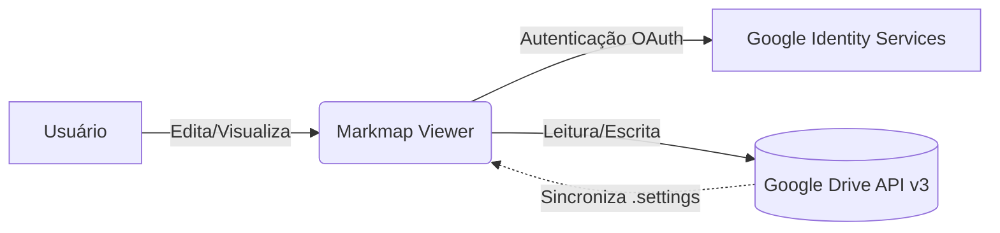
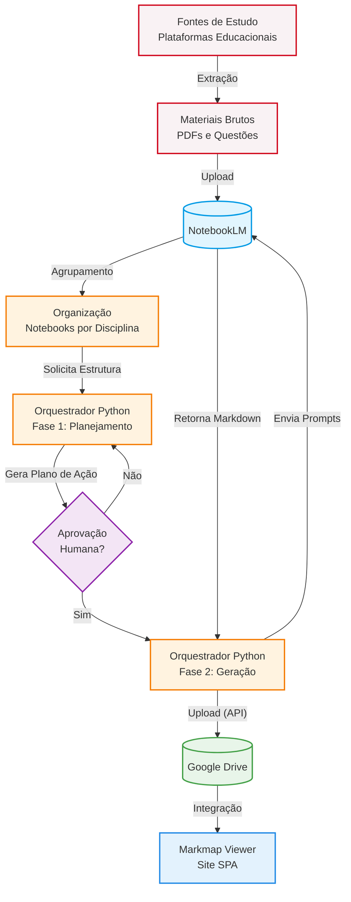

# 🧠 Markmap Viewer

[🇧🇷 Português](README.md) | [🇺🇸 English](README_en.md) | [🇪🇸 Español](README_es.md) | [🇨🇳 中文](README_zh.md) | [🇯🇵 日本語](README_ja.md)

Um visualizador e editor de mapas mentais interativos baseado na biblioteca **Markmap**, desenvolvido sob medida com uma interface de alta fidelidade e persistência de dados integrada diretamente ao **Google Drive**.

Ideal para estudantes e profissionais que necessitam organizar tópicos complexos, fazer revisão ativa de conteúdo, e compartilhar esquemas estruturados.

👉 **Acesso rápido:** [mapas-gilson.vercel.app](https://mapas-gilson.vercel.app/)

<a href="https://livepix.gg/gilsonnogueira" target="_blank"></a>

---

## ✨ Recursos Principais

### 1. Editor e Renderizador em Tempo Real
- **Editor Markdown WYSIWYG:** Workspace ágil com barra de ferramentas para formatação rápida e atalhos de teclado completos (Negrito `Ctrl+B`, Itálico `Ctrl+I`, Destaque `Ctrl+H`, Código `Ctrl+E`, Tachado `Ctrl+Shift+X`, Link `Ctrl+K`, Lista `Ctrl+L` e Citação `Ctrl+Q`), além de suporte a indentação automática via tecla `Tab` e renderização ágil por atalho rápido (`Ctrl + Enter`).
- **Renderização Rica:** Suporte a frontmatter YAML de configuração do Markmap, tags HTML embutidas (tamanhos de fonte, cores, negrito), tabelas, emojis e delimitadores de quebra.
- **Interatividade Total:** Controle nativo de aproximação (Zoom), centralização automática (Fit), além de nós expansíveis/retráteis que incentivam o estudo ativo por meio do encobrimento e revelação de conceitos.

### 2. Integração Robusta com o Google Drive (API v3)
- **Autenticação Segura (GIS):** Login simplificado e integrado com o Google Identity Services sem requisições repetidas de consentimento para usuários recorrentes.
- **Navegação Virtual ("Início"):** Uma central inteligente onde você pode fixar atalhos de pastas espalhadas por todo o seu Google Drive e acessá-las instantaneamente em um clique.
- **Pasta Padrão Dedicada:** Criação automática de um diretório centralizador chamado `Markmap Viewer` na raiz do Drive caso ele ainda não exista.
- **Sincronização de Configurações:** Sincronização automática das suas pastas fixadas na nuvem por meio do arquivo oculto `.markmap-settings.json` na raiz da pasta padrão do app no Drive, garantindo a mesma experiência em múltiplos dispositivos.
- **Organização Completa:** Criação de subpastas e salvamento de novos arquivos diretamente no diretório atualmente visualizado na barra lateral do painel.

### 3. Modo de Visualização Compartilhada (Shared View)
- **Modo Leitor Público:** Compartilhamento simples de mapas individuais através de parâmetros de URL (`?id=ID_DO_ARQUIVO`). Qualquer visitante com o link pode visualizar e interagir com o mapa sem precisar de login.
- **Configuração no Google Cloud Console:** O acesso público é feito via uma `API_KEY` do Google Cloud vinculada a uma Conta de Serviço (Service Account). Para que um mapa apareça na galeria pública, você deve compartilhar a pasta contendo os arquivos `.md` no seu Google Drive diretamente com o e-mail desse bot de serviço.
- **Controles Preservados:** O visitante tem acesso a ferramentas de ajuste de tamanho de fonte, alternância de tema escuro/claro, botões de zoom e colapso de nós, porém a barra de edição, o painel do Google Drive e as opções de exportação ficam completamente invisíveis.
- **Segurança de Acesso:** O site utiliza uma leitura pública do arquivo com base em uma `API_KEY` para obter os dados do arquivo marcado como compartilhado, assegurando que o código interno e os outros mapas privados da sua conta permaneçam inacessíveis a terceiros.

### 4. Ferramentas de Exportação Profissional
- **Exportar como SVG:** Arquivo vetorial de alta definição para edição posterior ou inclusão em relatórios.
- **Exportar como PNG:** Imagem renderizada em alta definição (escala 2x) ideal para colagem rápida em cadernos digitais ou apresentações.
- **Exportar como HTML:** Página web offline e autossuficiente contendo o visualizador e o mapa mental incorporados com todas as interatividades ativas.

---

## 🗂 Estrutura e Padrão de Codificação Recomendado

Para um estudo aprofundado das técnicas de retenção, curva de esquecimento e elaboração de mapas, consulte o [Guia de Criação de Mapas Mentais](Guia_Criacao_Mapas_Mentais.md) incluído no repositório.

O template embutido no projeto segue a seguinte convenção hierárquica e estilística recomendada:

```yaml
---
markmap:
  initialExpandLevel: 2
  maxWidth: 400
  spacingHorizontal: 100
  spacingVertical: 32
---
```

### Hierarquia Visual
- **Raiz do Assunto:** `# <span style="font-size: 1.8em;">**Disciplina** <br> Assunto</span>`
- **Nível 1 (Tópico principal):** `- <span style="font-size: 1.3em;">**Tópico**</span> <!-- fold -->`
- **Nível 2 (Subtópicos):** `- <span style="font-size: 1.1em;">**Subtópico**</span>`
- **Nível 3+:** Subtópicos em formato markdown simples com listas não ordenadas.


---

## 🏗️ Arquitetura do Sistema

O projeto é uma aplicação Single Page Application (SPA) que utiliza uma arquitetura descentralizada para garantir alta performance e privacidade dos dados.

*Fluxo de Dados e Limites de Confiança:*



A aplicação não possui backend próprio, garantindo que 100% do tráfego de dados sensíveis ocorra diretamente e exclusivamente entre o navegador do usuário (Frontend) e os serviços de armazenamento e identidade do Google.

---


- **Núcleo Lógico e Visual:** HTML5 Semântico, CSS Vanilla (Estilo personalizado com paleta baseada em HSL e variáveis CSS dinâmicas para modo escuro/claro).
- **Bibliotecas de Terceiros:**
  - [D3.js (v7)](https://d3js.org/) — Biblioteca para manipulação de SVG/Documentos baseados em dados.
  - [Markmap Lib / Markmap View](https://markmap.js.org/) — Componentes essenciais de conversão de markdown e renderização.
- **Serviços do Google:**
  - Google API Client Library (`gapi.js`) & Google Identity Services SDK (`client.js`).
  - Google Drive REST API v3 para criação, leitura, atualização e atribuição de permissões de leitura pública (`anyone` / `reader`).

---

## 🚀 Uso Local e Desenvolvimento

1. **Clonar o Repositório:**
   ```bash
   git clone https://github.com/gilsonnogueira/markmap-viewer.git
   cd markmap-viewer
   ```
2. **Executar Localmente:**
   Como é uma Single Page Application (SPA) totalmente construída em front-end puro, você pode simplesmente abrir o arquivo `index.html` diretamente em qualquer navegador moderno.
   
   *Nota: Devido aos requisitos de CORS das APIs do Google Client, para testar a integração com o Drive localmente, recomenda-se iniciar um servidor HTTP simples na pasta do projeto:*
   ```bash
   # Utilizando Python
   python -m http.server 8000
   
   # Ou utilizando Node.js
   npx serve .
   ```
   Acesse a aplicação via `http://localhost:8000`.

---

## 🗺️ Roadmap e Trabalhos Futuros

Está planejada a automação completa da criação estruturada de mapas mentais utilizando a IA do Google (NotebookLM) conectada diretamente a este sistema e ao Google Drive. 

Para conferir o planejamento técnico e a viabilidade desta arquitetura, consulte o [Estudo de Viabilidade - Automação NotebookLM](docs/Estudo_Viabilidade_NotebookLM.md).



---

## 📄 Licença

Este projeto é de uso livre para estudos, revisão ativa de conteúdos e fins educacionais.

---

## 🙏 Créditos e Agradecimentos

Este projeto foi construído utilizando a incrível biblioteca **[Markmap](https://github.com/markmap/markmap)** como motor principal de renderização dos mapas mentais. Todos os créditos aos desenvolvedores originais e mantenedores do Markmap por tornarem possível a visualização dinâmica de markdown.

## 🚀 Novas Atualizações (Julho de 2026)
- **Sistema de Exportação Nativo**: Agora você pode exportar mapas mentais individuais ou em lote (pastas inteiras) diretamente pelo navegador nos formatos **PDF, PNG, HTML e SVG**. Suporta temas (Dark, Light, E-ink) e fundo transparente.
- **Melhorias no Leitor de Áudio (TTS)**: O sistema de voz agora lê corretamente callouts, negritos e listas. O reconhecimento de arquivos de script foi aprimorado para ler estritamente arquivos .txt, ignorando PDFs acidentais.
