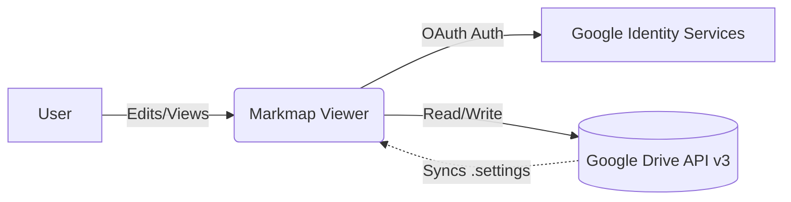
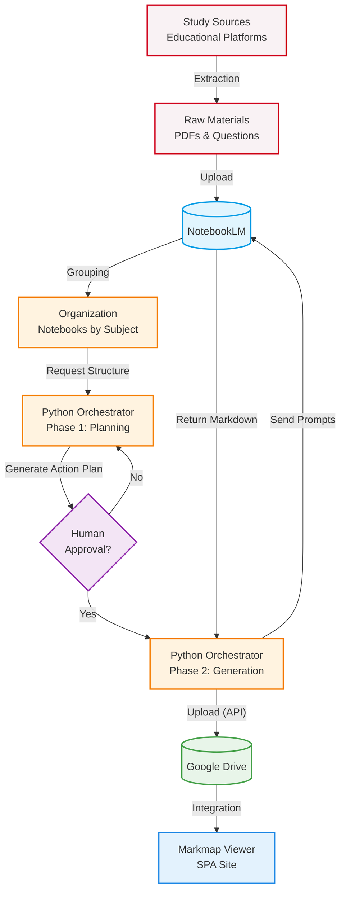

# 🧠 Markmap Viewer

[🇧🇷 Português](README.md) | [🇺🇸 English](README_en.md) | [🇪🇸 Español](README_es.md) | [🇨🇳 中文](README_zh.md) | [🇯🇵 日本語](README_ja.md)

An interactive mind map viewer and editor based on the **Markmap** library, custom-built with a high-fidelity interface and direct data persistence to **Google Drive**.

Ideal for students and professionals who need to organize complex topics, actively review content, and share structured outlines.

👉 **Quick access:** [mapas-gilson.vercel.app](https://mapas-gilson.vercel.app/)

<a href="https://livepix.gg/gilsonnogueira" target="_blank"></a>

---

## ✨ Key Features

### 1. Real-Time Editor and Renderer
- **WYSIWYG Markdown Editor:** Agile workspace with a formatting toolbar and complete keyboard shortcuts (Bold `Ctrl+B`, Italic `Ctrl+I`, Highlight `Ctrl+H`, Code `Ctrl+E`, Strikethrough `Ctrl+Shift+X`, Link `Ctrl+K`, List `Ctrl+L`, and Quote `Ctrl+Q`), plus auto-indentation via the `Tab` key and quick rendering (`Ctrl + Enter`).
- **Rich Rendering:** Support for Markmap's YAML frontmatter, embedded HTML tags (font sizes, colors), tables, emojis, and line breaks.
- **Full Interactivity:** Native zoom control, auto-fit, and expandable/collapsible nodes that encourage active recall study.

### 2. Robust Google Drive Integration (API v3)
- **Secure Authentication (GIS):** Simplified login integrated with Google Identity Services without repeated consent requests.
- **Virtual Navigation ("Home"):** A smart hub where you can pin shortcuts from scattered Google Drive folders.
- **Dedicated Default Folder:** Automatic creation of a central directory named `Markmap Viewer` at your Drive's root.
- **Settings Sync:** Automatic cloud synchronization of pinned folders via a hidden `.markmap-settings.json` file.
- **Full Organization:** Create subfolders and save new files directly into the currently viewed directory.

### 3. Shared View Mode
- **Public Reader Mode:** Simple sharing of individual maps via URL parameters (`?id=FILE_ID`). Visitors can interact with the map without logging in.
- **Preserved Controls:** Visitors can adjust font size, toggle dark/light themes, zoom, and collapse nodes, while editing tools remain invisible.
- **Access Security:** Uses a Google Cloud `API_KEY` to read only specific files shared with the service account.

### 4. Professional Export Tools
- **Export as SVG:** High-definition vector file.
- **Export as PNG:** High-resolution rendered image (2x scale).
- **Export as HTML:** Offline, self-contained web page with the viewer and mind map embedded.

---

## 🗂 Recommended Structure and Coding Standard

For an in-depth study on retention techniques, see the [Mind Map Creation Guide](Guia_Criacao_Mapas_Mentais.md) included in the repository.

The built-in template follows this recommended stylistic convention:

```yaml
---
markmap:
  initialExpandLevel: 2
  maxWidth: 400
  spacingHorizontal: 100
  spacingVertical: 32
---
```

### Visual Hierarchy
- **Subject Root:** `# <span style="font-size: 1.8em;">**Subject** <br> Topic</span>`
- **Level 1 (Main Topic):** `- <span style="font-size: 1.3em;">**Topic**</span> <!-- fold -->`
- **Level 2 (Subtopics):** `- <span style="font-size: 1.1em;">**Subtopic**</span>`
- **Level 3+:** Standard markdown unordered lists.

---

## 🏗️ System Architecture

The project is a Single Page Application (SPA) utilizing a decentralized architecture for high performance and data privacy.

*Data Flow and Trust Boundaries:*



The application has no backend of its own; 100% of sensitive data traffic occurs exclusively between the user's browser (Frontend) and Google's services.

---

- **Core & Visuals:** Semantic HTML5, Vanilla CSS.
- **Third-Party Libraries:**
  - [D3.js (v7)](https://d3js.org/) — SVG manipulation.
  - [Markmap Lib / Markmap View](https://markmap.js.org/) — Markdown rendering.
- **Google Services:**
  - Google API Client Library (`gapi.js`) & Google Identity Services SDK (`client.js`).
  - Google Drive REST API v3.

---

## 🚀 Local Usage & Development

1. **Clone the Repository:**
   ```bash
   git clone https://github.com/gilsonnogueira/markmap-viewer.git
   cd markmap-viewer
   ```
2. **Run Locally:**
   Simply open `index.html` in any browser. For Drive integration testing, run a local server:
   ```bash
   python -m http.server 8000
   ```

---

## 🗺️ Roadmap & Future Works

Full automation of mind map creation using Google AI (NotebookLM) connected directly to this system and Google Drive is planned.

For technical planning and feasibility, see the [NotebookLM Automation Feasibility Study](docs/Estudo_Viabilidade_NotebookLM.md).



---

## 📄 License

This project is free for study, active content review, and educational purposes.

---

## 🙏 Credits and Acknowledgments

Built using the amazing **[Markmap](https://github.com/markmap/markmap)** library as the core rendering engine. All credits to the original Markmap developers and maintainers.
