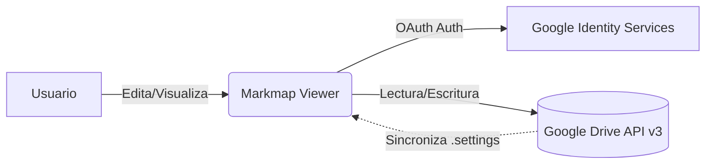
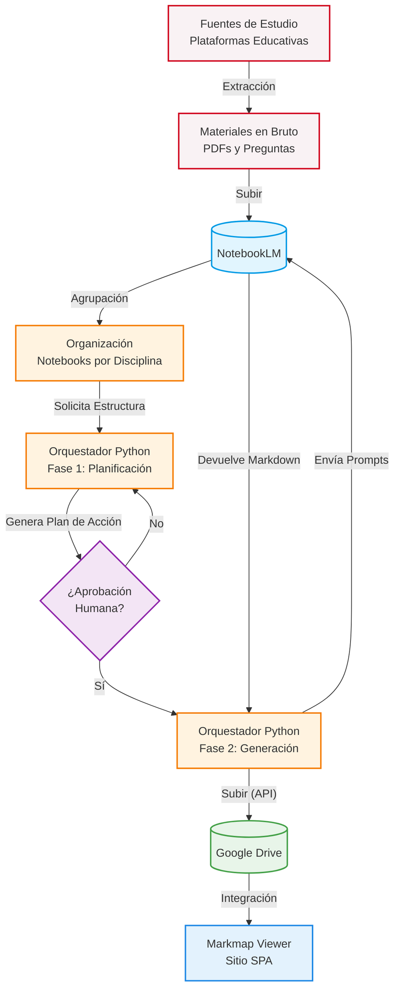

# 🧠 Markmap Viewer

[🇧🇷 Português](README.md) | [🇺🇸 English](README_en.md) | [🇪🇸 Español](README_es.md) | [🇨🇳 中文](README_zh.md) | [🇯🇵 日本語](README_ja.md) | [🇫🇷 Français](README_fr.md) | [🇩🇪 Deutsch](README_de.md) | [🇷🇺 Русский](README_ru.md) | [🇰🇷 한국어](README_ko.md) | [🇮🇳 हिन्दी](README_hi.md)

Un visor y editor interactivo de mapas mentales basado en la biblioteca **Markmap**, desarrollado a medida con una interfaz de alta fidelidad y persistencia de datos integrada directamente con **Google Drive**.

Ideal para estudiantes y profesionales que necesitan organizar temas complejos, revisar contenido activamente y compartir esquemas estructurados.

👉 **Acceso rápido:** [mapas-gilson.vercel.app](https://mapas-gilson.vercel.app/)

<a href="https://livepix.gg/gilsonnogueira" target="_blank"></a>

---


## 📸 Galería de Imágenes
| Editor (Dark Mode) | Editor (Light Mode) | Editor (E-ink Mode) |
| :---: | :---: | :---: |
|  |  |  |

| Vitrine / Gallery | Meu Drive / My Drive | Modo Foco / Focus Mode |
| :---: | :---: | :---: |
|  |  |  |

| Exportação / Export | Text-to-Speech (TTS) |
| :---: | :---: |
|  |  |

---

: | :---: | :---: |
|  |  |  |

| Vitrine / Gallery | Meu Drive / My Drive | Modo Foco / Focus Mode |
| :---: | :---: | :---: |
|  |  |  |

| Exportação / Export | Text-to-Speech (TTS) |
| :---: | :---: |
|  |  |

---: | :---: | :---: |
|  |  |  |

| Exportação / Export | Text-to-Speech (TTS) |
| :---: | :---: |
|  |  |

---: | :---: |
|  |  |

| Vitrine / Gallery | Modo Foco / Focus Mode |
| :---: | :---: |
|  |  |

| Exportação / Export Options |
| :---: |
|  |

---

## ✨ Características Principales

### 1. Editor y Renderizador en Tiempo Real
- **Editor Markdown WYSIWYG:** Espacio de trabajo ágil con barra de herramientas de formato y atajos de teclado completos (Negrita `Ctrl+B`, Cursiva `Ctrl+I`, Resaltado `Ctrl+H`, Código `Ctrl+E`, Tachado `Ctrl+Shift+X`, Enlace `Ctrl+K`, Lista `Ctrl+L` y Cita `Ctrl+Q`), soporte para indentación automática con `Tab` y renderizado rápido (`Ctrl + Enter`).
- **Renderizado Enriquecido:** Soporte para frontmatter YAML de Markmap, etiquetas HTML (tamaños de fuente, colores), tablas, emojis y saltos de línea.
- **Interactividad Total:** Zoom nativo, ajuste automático y nodos expandibles/colapsables que fomentan el estudio por recuerdo activo.

### 2. Integración Robusta con Google Drive (API v3)
- **Autenticación Segura (GIS):** Inicio de sesión simplificado con Google Identity Services.
- **Navegación Virtual ("Inicio"):** Un centro inteligente donde puedes anclar accesos directos a carpetas.
- **Carpeta Predeterminada:** Creación automática de un directorio central llamado `Markmap Viewer` en la raíz de Drive.
- **Sincronización de Configuración:** Sincronización en la nube mediante un archivo oculto `.markmap-settings.json`.
- **Organización Completa:** Crea subcarpetas y guarda archivos directamente en el panel actual.

### 3. Modo de Vista Compartida (Shared View)
- **Modo Lector Público:** Uso compartido de mapas individuales a través de URL (`?id=ID_DEL_ARCHIVO`).
- **Controles Preservados:** Los visitantes pueden ajustar el tamaño de fuente, temas y zoom, pero la barra de edición y el panel de Google Drive permanecen ocultos.
- **Seguridad de Acceso:** Utiliza una `API_KEY` de Google Cloud para el acceso público de solo lectura.

### 4. Herramientas de Exportación Profesional
- **Exportar como SVG:** Archivo vectorial de alta definición.
- **Exportar como PNG:** Imagen de alta resolución renderizada (escala 2x).
- **Exportar como HTML:** Página web sin conexión que incluye el visor y el mapa incrustado.

---

## 🗂 Estructura y Estándar de Codificación

Para un estudio detallado sobre técnicas de retención, consulta la [Guía de Creación de Mapas Mentales](Guia_Criacao_Mapas_Mentais.md).

La plantilla recomendada sigue esta convención:

```yaml
---
markmap:
  initialExpandLevel: 2
  maxWidth: 400
  spacingHorizontal: 100
  spacingVertical: 32
---
```

### Jerarquía Visual
- **Raíz del Tema:** `# <span style="font-size: 1.8em;">**Disciplina** <br> Asunto</span>`
- **Nivel 1 (Tema Principal):** `- <span style="font-size: 1.3em;">**Tema**</span> <!-- fold -->`
- **Nivel 2 (Subtemas):** `- <span style="font-size: 1.1em;">**Subtema**</span>`
- **Nivel 3+:** Listas desordenadas de markdown estándar.

---

## 🏗️ Arquitectura del Sistema

El proyecto es una Single Page Application (SPA) descentralizada.

*Flujo de Datos:*



La aplicación no tiene backend propio. Todo el tráfico de datos confidenciales fluye entre el navegador del usuario y Google.

---

## 🚀 Uso Local y Desarrollo

1. **Clonar Repositorio:**
   ```bash
   git clone https://github.com/gilsonnogueira/markmap-viewer.git
   cd markmap-viewer
   ```
2. **Ejecutar Localmente:**
   Abre `index.html`. Para pruebas con Google Drive, inicia un servidor local:
   ```bash
   python -m http.server 8000
   ```

---

## 🗺️ Roadmap y Trabajos Futuros

Está planificada la automatización de la creación de mapas mentales utilizando la IA de Google (NotebookLM). Consulta el [Estudio de Viabilidad Técnica](docs/Estudo_Viabilidade_NotebookLM.md).



---

## 📄 Licencia

Este proyecto es de uso libre para estudio, revisión activa de contenidos y fines educativos.

---

## 🙏 Créditos

Construido utilizando la increíble biblioteca **[Markmap](https://github.com/markmap/markmap)** como motor de renderizado. Todos los créditos a sus desarrolladores originales.

## 🚀 Nuevas Actualizaciones (Julio de 2026)
- **Sistema de Exportación Nativo**: Ahora puede exportar mapas mentales individuales o por lotes (carpetas enteras) directamente en el navegador en formatos **PDF, PNG, HTML y SVG**. Soporta temas (Oscuro, Claro, E-ink) y fondos transparentes.
- **Mejoras en el Lector de Audio (TTS)**: El motor de voz ahora lee correctamente llamadas (callouts), negritas y listas. El reconocimiento de archivos de guion se ha mejorado para leer estrictamente archivos .txt, ignorando PDFs accidentales.
