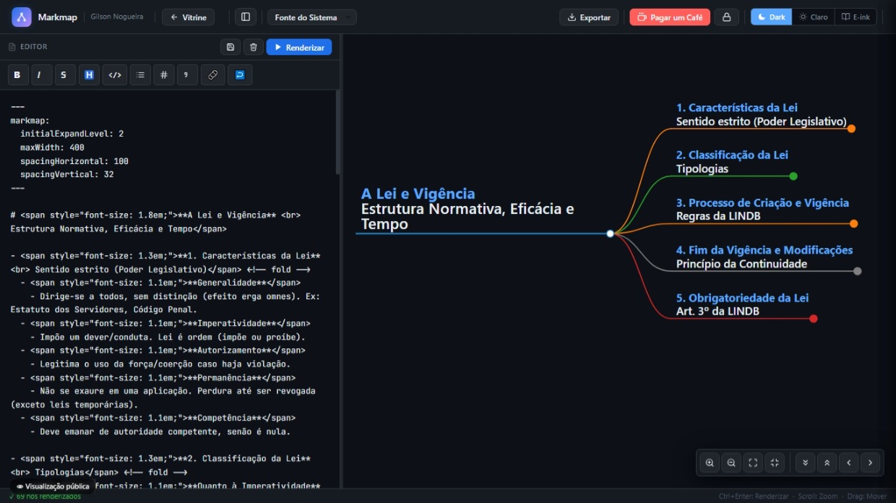
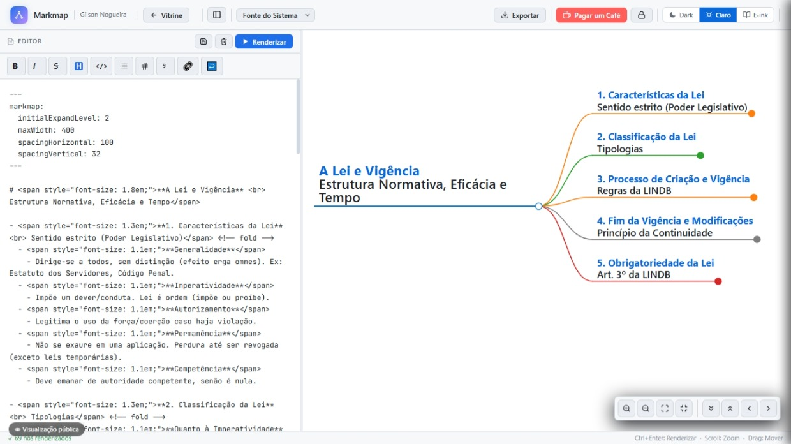
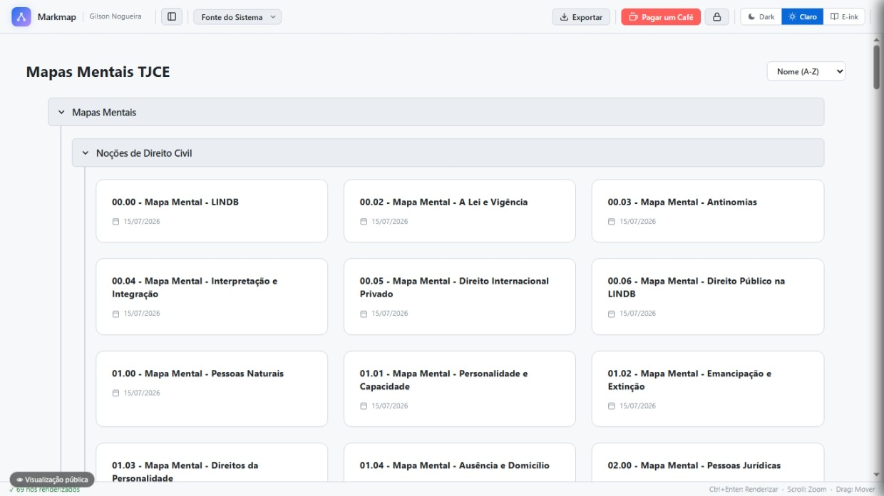
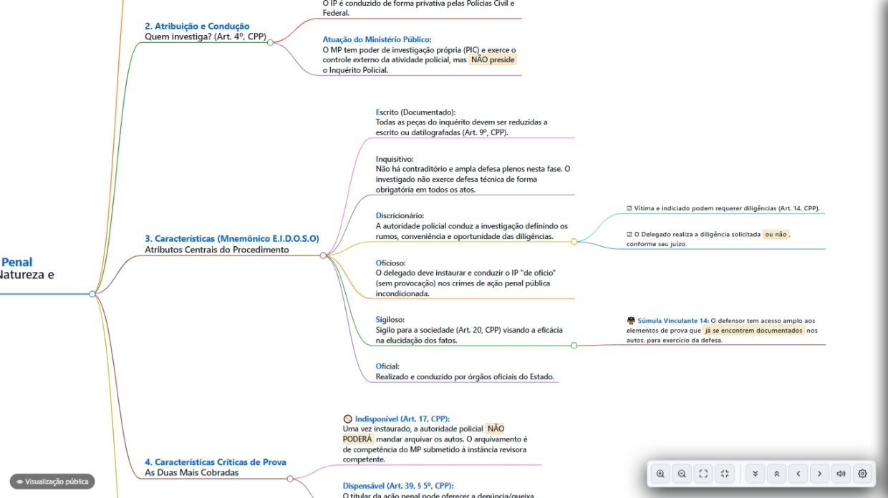
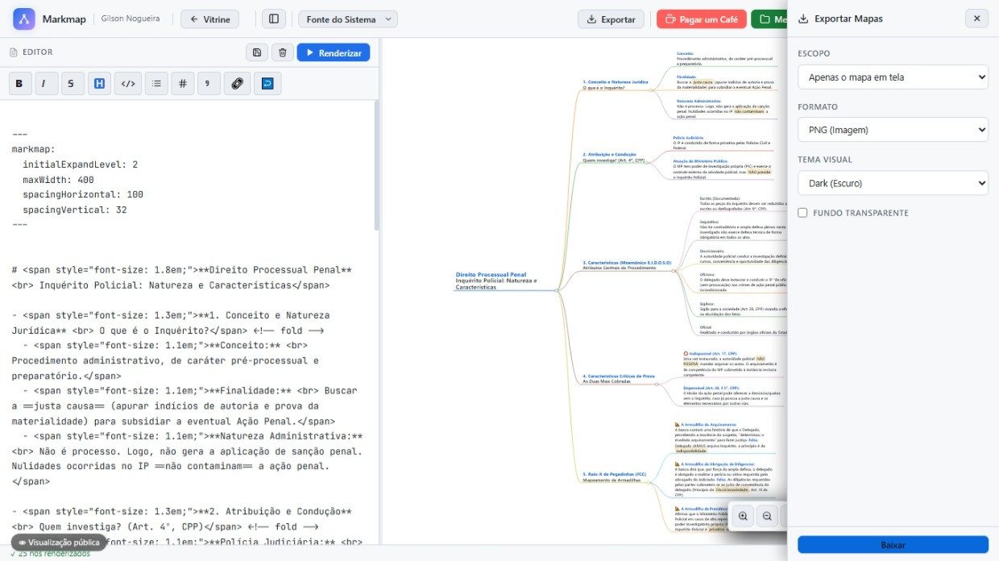
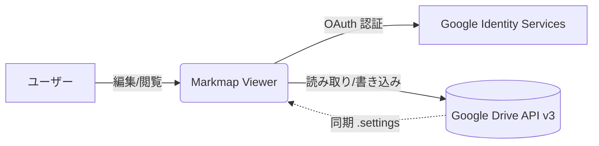
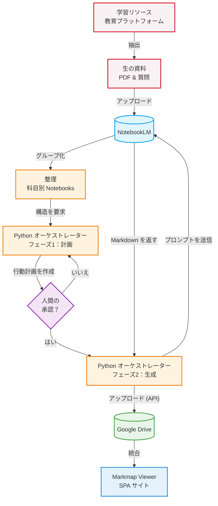

# 🧠 Markmap Viewer

[🇧🇷 Português](README.md) | [🇺🇸 English](README_en.md) | [🇪🇸 Español](README_es.md) | [🇨🇳 中文](README_zh.md) | [🇯🇵 日本語](README_ja.md) | [🇫🇷 Français](README_fr.md) | [🇩🇪 Deutsch](README_de.md) | [🇷🇺 Русский](README_ru.md) | [🇰🇷 한국어](README_ko.md) | [🇮🇳 हिन्दी](README_hi.md)

**Markmap** ライブラリをベースにした、インタラクティブなマインドマップビューア兼エディタです。高品質なインターフェースを提供し、**Google Drive** と直接連携してデータを保存します。

複雑なトピックを整理し、能動的にコンテンツを復習し、構造化されたアウトラインを共有したい学生や専門家に最適です。

👉 **クイックアクセス:** [mapas-gilson.vercel.app](https://mapas-gilson.vercel.app/)

<a href="https://livepix.gg/gilsonnogueira" target="_blank"></a>

---


## 📸 ギャラリー / スクリーンショット

| Editor (Dark Mode) | Editor (Light Mode) |
| :---: | :---: |
|  |  |

| Vitrine / Gallery | Modo Foco / Focus Mode |
| :---: | :---: |
|  |  |

| Exportação / Export Options |
| :---: |
|  |

---

## ✨ 主な機能

### 1. リアルタイムエディタとレンダラー
- **WYSIWYG Markdown エディタ:** フォーマットツールバーと完全なキーボードショートカット（太字 `Ctrl+B`、斜体 `Ctrl+I`、ハイライト `Ctrl+H`、コード `Ctrl+E`、取り消し線 `Ctrl+Shift+X`、リンク `Ctrl+K`、リスト `Ctrl+L`、引用 `Ctrl+Q`）を備えた機敏なワークスペース。`Tab` キーによる自動インデントと高速レンダリング（`Ctrl + Enter`）にも対応しています。
- **リッチなレンダリング:** Markmap の YAML フロントマター、インライン HTML タグ（フォントサイズ、色）、テーブル、絵文字、改行をサポート。
- **完全なインタラクティビティ:** ネイティブなズーム制御、自動中央揃え、アクティブリコール学習を促す展開/折りたたみ可能なノード。

### 2. 強固な Google Drive 連携 (API v3)
- **安全な認証 (GIS):** Google Identity Services を使用したシンプルなログイン。
- **仮想ナビゲーション ("ホーム"):** 分散している Google Drive フォルダのショートカットを固定できるスマートハブ。
- **専用のデフォルトフォルダ:** Drive のルートディレクトリに `Markmap Viewer` というフォルダを自動作成。
- **設定の同期:** 隠しファイル `.markmap-settings.json` を通じて、ピン留めされたフォルダをクラウド上で自動同期。
- **完全な整理機能:** サブフォルダを作成し、現在のパネルに直接新しいファイルを保存できます。

### 3. 共有ビューモード (Shared View)
- **パブリックリーダーモード:** URL パラメータ (`?id=FILE_ID`) を使用して個々のマップを簡単に共有。訪問者はログインなしで閲覧・操作できます。
- **コントロールの保持:** 訪問者はフォントサイズの調整、テーマの切り替え、ズーム、ノードの折りたたみを行えますが、編集ツールは非表示になります。
- **アクセスの安全性:** サービスアカウントと共有された特定のファイルを読み取り専用でアクセスするために、Google Cloud の `API_KEY` を使用します。

### 4. プロフェッショナルなエクスポートツール
- **SVG でエクスポート:** 高解像度のベクターファイル。
- **PNG でエクスポート:** レンダリングされた高解像度画像 (2 倍スケール)。
- **HTML でエクスポート:** ビューアとマインドマップが埋め込まれたオフライン用の独立したウェブページ。

---

## 🗂 推奨される構造とコーディング規約

保持テクニックの詳細については、リポジトリに含まれている[マインドマップ作成ガイド](Guia_Criacao_Mapas_Mentais.md)を参照してください。

組み込みのテンプレートは、以下の推奨スタイル規約に従っています：

```yaml
---
markmap:
  initialExpandLevel: 2
  maxWidth: 400
  spacingHorizontal: 100
  spacingVertical: 32
---
```

### 視覚的な階層構造
- **トピックのルート:** `# <span style="font-size: 1.8em;">**科目** <br> トピック</span>`
- **レベル 1 (メイントピック):** `- <span style="font-size: 1.3em;">**トピック**</span> <!-- fold -->`
- **レベル 2 (サブトピック):** `- <span style="font-size: 1.1em;">**サブトピック**</span>`
- **レベル 3+:** 標準の markdown 箇条書きリスト。

---

## 🏗️ システムアーキテクチャ

このプロジェクトは、高いパフォーマンスとデータプライバシーを確保するために分散型アーキテクチャを利用したシングルページアプリケーション (SPA) です。

*データフロー:*



このアプリケーションには独自のバックエンドがありません。すべての機密データ通信は、ユーザーのブラウザと Google 間でのみ直接行われます。

---

## 🚀 ローカルでの使用と開発

1. **リポジトリのクローン:**
   ```bash
   git clone https://github.com/gilsonnogueira/markmap-viewer.git
   cd markmap-viewer
   ```
2. **ローカルでの実行:**
   `index.html` を開くだけです。Google Drive 連携をテストする場合は、ローカルサーバーを起動してください：
   ```bash
   python -m http.server 8000
   ```

---

## 🗺️ ロードマップと今後の作業

Google AI (NotebookLM) をこのシステムおよび Google Drive に直接接続し、マインドマップ作成を完全に自動化することが計画されています。

技術的な計画と実現可能性については、[NotebookLM 自動化の実現可能性調査](docs/Estudo_Viabilidade_NotebookLM.md)をご覧ください。



---

## 📄 ライセンス

このプロジェクトは、学習、コンテンツの能動的な復習、教育目的で無料で使用できます。

---

## 🙏 クレジットと謝辞

コアのレンダリングエンジンとして素晴らしい **[Markmap](https://github.com/markmap/markmap)** ライブラリを使用しています。オリジナルの開発者にすべてのクレジットが帰属します。

## 🚀 新しいアップデート (2026年7月)
- **ネイティブエクスポートシステム**: ブラウザから直接、単一のマインドマップまたはフォルダ全体を**PDF、PNG、HTML、SVG**形式で一括エクスポートできるようになりました。テーマ（ダーク、ライト、E-ink）や透過背景をサポートしています。
- **テキスト読み上げ (TTS) の改善**: 音声エンジンがコールアウト、太字、リストを正しく読み上げるようになりました。スクリプトファイルの認識が改善され、誤ってPDFを読み込むことなく、厳密に.txtファイルのみを読み込むようになりました。
