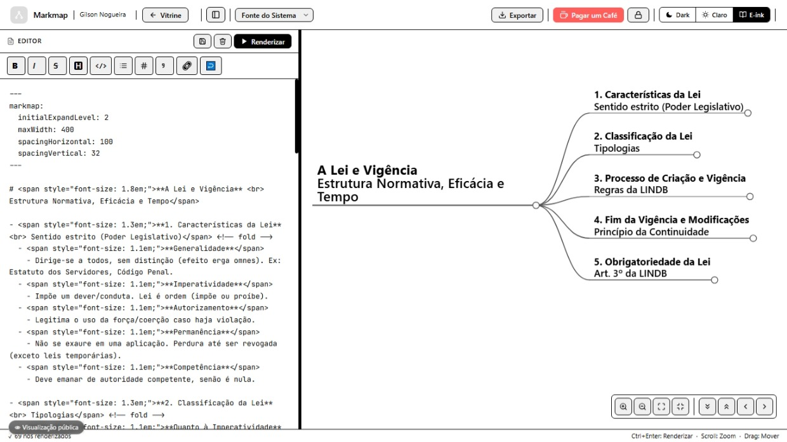
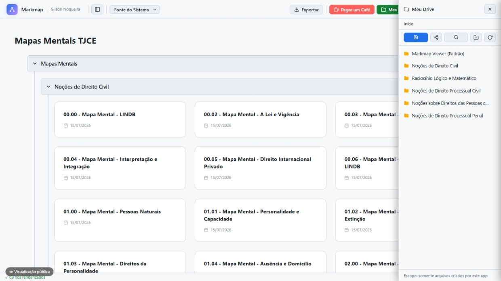
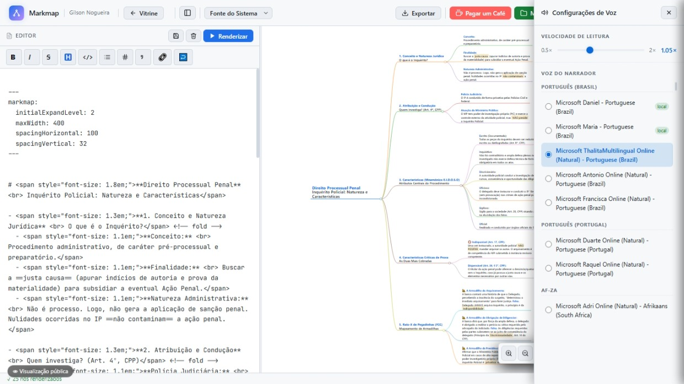
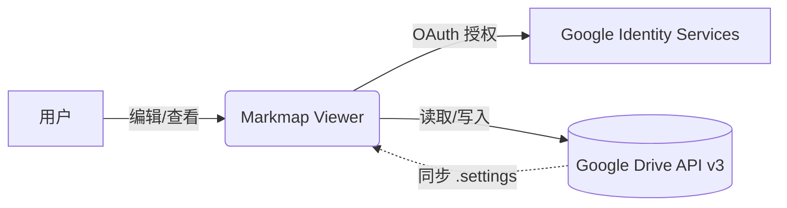
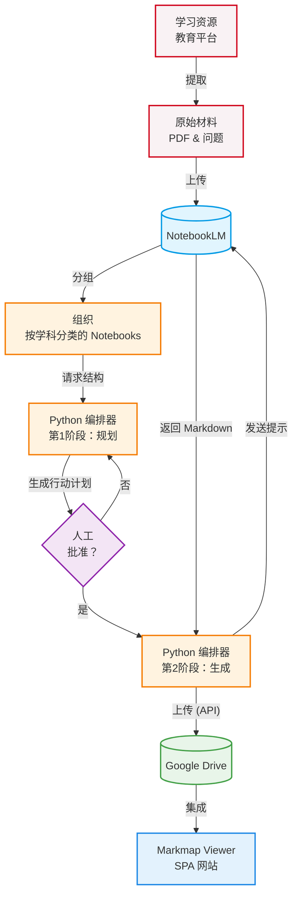

# 🧠 Markmap Viewer

[🇧🇷 Português](README.md) | [🇺🇸 English](README_en.md) | [🇪🇸 Español](README_es.md) | [🇨🇳 中文](README_zh.md) | [🇯🇵 日本語](README_ja.md) | [🇫🇷 Français](README_fr.md) | [🇩🇪 Deutsch](README_de.md) | [🇷🇺 Русский](README_ru.md) | [🇰🇷 한국어](README_ko.md) | [🇮🇳 हिन्दी](README_hi.md)

基于 **Markmap** 库的交互式思维导图查看器和编辑器。它提供高保真度的界面，并将数据直接持久化到 **Google Drive**。

非常适合需要整理复杂主题、主动复习内容并分享结构化大纲的学生和专业人士。

👉 **快速访问:** [mapas-gilson.vercel.app](https://mapas-gilson.vercel.app/)

<a href="https://livepix.gg/gilsonnogueira" target="_blank"></a>

---


## 📸 界面展示 / 截图
| Editor (Dark Mode) | Editor (Light Mode) | Editor (E-ink Mode) |
| :---: | :---: | :---: |
|  |  |  |

| Vitrine / Gallery | Meu Drive / My Drive | Modo Foco / Focus Mode |
| :---: | :---: | :---: |
|  |  |  |

| Exportação / Export | Text-to-Speech (TTS) |
| :---: | :---: |
|  |  |

---

: | :---: | :---: |
|  |  |  |

| Vitrine / Gallery | Meu Drive / My Drive | Modo Foco / Focus Mode |
| :---: | :---: | :---: |
|  |  |  |

| Exportação / Export | Text-to-Speech (TTS) |
| :---: | :---: |
|  |  |

---: | :---: | :---: |
|  |  |  |

| Exportação / Export | Text-to-Speech (TTS) |
| :---: | :---: |
|  |  |

---: | :---: |
|  |  |

| Vitrine / Gallery | Modo Foco / Focus Mode |
| :---: | :---: |
|  |  |

| Exportação / Export Options |
| :---: |
|  |

---

## ✨ 主要功能

### 1. 实时编辑器和渲染器
- **WYSIWYG Markdown 编辑器:** 灵活的工作区，包含格式化工具栏和完整的键盘快捷键（粗体 `Ctrl+B`、斜体 `Ctrl+I`、高亮 `Ctrl+H`、代码 `Ctrl+E`、删除线 `Ctrl+Shift+X`、链接 `Ctrl+K`、列表 `Ctrl+L` 和 引用 `Ctrl+Q`），并通过 `Tab` 键支持自动缩进，快速渲染 (`Ctrl + Enter`)。
- **丰富的渲染:** 支持 Markmap 的 YAML 配置、内联 HTML 标签（字体大小、颜色）、表格、表情符号和换行符。
- **完全互动:** 原生缩放控制、自动居中、可展开/折叠节点，有助于通过主动回忆来进行学习。

### 2. 强大的 Google Drive 集成 (API v3)
- **安全身份验证 (GIS):** 与 Google 身份服务集成，简化登录过程。
- **虚拟导航 (“主页”):** 智能中心，可以将分散的 Google Drive 文件夹中的快捷方式固定在此。
- **专用默认文件夹:** 在 Drive 的根目录自动创建名为 `Markmap Viewer` 的目录。
- **设置同步:** 通过隐藏的 `.markmap-settings.json` 文件自动在云端同步固定文件夹。
- **完整的组织管理:** 可直接在当前面板创建子文件夹并保存新文件。

### 3. 共享查看模式 (Shared View)
- **公共阅读器模式:** 通过 URL 参数 (`?id=FILE_ID`) 轻松共享单个导图。访问者无需登录即可进行交互。
- **保留控件:** 访问者可以调整字体大小、切换深色/浅色主题、缩放和折叠节点，但编辑工具处于隐藏状态。
- **访问安全:** 使用 Google Cloud `API_KEY` 以便只读访问与服务帐户共享的特定文件。

### 4. 专业的导出工具
- **导出为 SVG:** 高清矢量文件。
- **导出为 PNG:** 高分辨率渲染图像（2 倍缩放）。
- **导出为 HTML:** 包含查看器和内嵌思维导图的离线独立网页。

---

## 🗂 推荐的结构和编码规范

关于记忆技巧的深入学习，请参阅存储库中包含的[思维导图创建指南](Guia_Criacao_Mapas_Mentais.md)。

内置模板遵循以下建议的样式规范：

```yaml
---
markmap:
  initialExpandLevel: 2
  maxWidth: 400
  spacingHorizontal: 100
  spacingVertical: 32
---
```

### 视觉层次结构
- **主题根节点:** `# <span style="font-size: 1.8em;">**学科** <br> 主题</span>`
- **级别 1 (主主题):** `- <span style="font-size: 1.3em;">**主题**</span> <!-- fold -->`
- **级别 2 (子主题):** `- <span style="font-size: 1.1em;">**子主题**</span>`
- **级别 3+:** 标准 markdown 无序列表。

---

## 🏗️ 系统架构

该项目是一个单页应用程序 (SPA)，采用去中心化架构，具有高性能和数据隐私。

*数据流:*



该应用程序没有自己的后端。100% 的敏感数据流量仅在用户的浏览器和 Google 之间发生。

---

## 🚀 本地使用与开发

1. **克隆存储库:**
   ```bash
   git clone https://github.com/gilsonnogueira/markmap-viewer.git
   cd markmap-viewer
   ```
2. **在本地运行:**
   打开 `index.html` 即可。要测试 Google Drive 集成，请运行本地服务器：
   ```bash
   python -m http.server 8000
   ```

---

## 🗺️ 路线图和未来工作

计划实现使用 Google AI (NotebookLM) 直接连接到此系统和 Google Drive 来自动化思维导图创建的功能。

有关技术规划和可行性，请参见 [NotebookLM 自动化可行性研究](docs/Estudo_Viabilidade_NotebookLM.md)。



---

## 📄 许可证

本项目免费用于学习、内容复习和教育目的。

---

## 🙏 致谢

使用出色的 **[Markmap](https://github.com/markmap/markmap)** 库作为核心渲染引擎。感谢所有原始开发人员。

## 🚀 最新更新 (2026年7月)
- **原生导出系统**: 现在可以直接在浏览器中将单个思维导图或整个文件夹批量导出为 **PDF、PNG、HTML 和 SVG** 格式。支持主题（深色、浅色、电子墨水）和透明背景。
- **语音朗读 (TTS) 改进**: 语音引擎现在可以正确朗读标注 (callouts)、粗体文本和列表。脚本文件识别已得到改进，严格只读取 .txt 文件，忽略意外的 PDF 文件。
